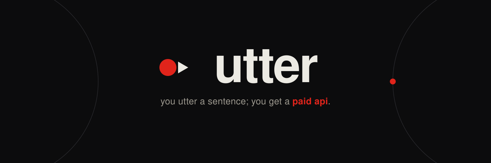

<p align="center">
  
</p>

# Utter

**You utter a sentence. You get a paid API.**

Utter turns one plain English sentence into a live API that AI agents discover and pay for per call in USDC, built natively on **Arc**, Circle's stablecoin L1. A creator describes an endpoint, Utter generates the code, runs it in an isolated sandbox, verifies it works, gives it an onchain identity, and lists it on a marketplace with an agent card. From there, other AI agents find it and pay for it on their own, with no API keys and no humans in the loop. The creator keeps the majority of every call.

x402 gave agents a way to pay. Utter is the factory for what they buy. It is the supply side of the agent economy.

- **Live app:** https://app.utter.technology
- **Demo video:** [watch the demo](https://vimeo.com/share/9e35ae17-192f-4b04-bd6c-12c3907aa2ce?share=copy&fl=sv&fe=ci)
- **X / Twitter:** [@utter_tech](https://x.com/utter_tech)
- **Chain:** Arc Testnet (chainId `5042002`), settlement in USDC
- **Explorer:** https://testnet.arcscan.app

---

## The problem

AI agents can now hold and move money. The problem is there is almost nothing built for them to actually buy. And putting a small paid API into the world still means servers, Stripe, API keys, auth, and ops, so the long tail of useful tools never gets monetized. Even when a service exists, an agent cannot really use it on its own, because it needs a signup, a key, and it has to pay before it even knows if the answer is any good.

Utter closes that gap: describe an endpoint in one sentence and get a live API that agents discover and pay for per call in USDC, with payment taken only **after** the response passes validation, so an agent never pays for a bad answer.

---

## How it works

1. **Utter.** You type a sentence in the studio. Claude writes the handler code, the API schema, and test cases.
2. **Gate.** A static security scan checks the generated code for secrets and dangerous imports before anything is built.
3. **Deploy.** The deployer builds a container and runs the untrusted handler inside a **gVisor** sandbox with deny by default egress through a data proxy, no secrets, and resource, timeout, and size caps. A trusted sidecar sits in front and owns the money path.
4. **Verify.** A smoke test confirms the endpoint actually works.
5. **Identity + publish.** It gets an onchain ERC-8004 identity, is registered onchain, and is listed on the marketplace with an A2A agent card so other agents can discover it.
6. **Pay.** An agent calls the endpoint and gets a `402`. It signs a USDC payment, the facilitator reserves the cap in the escrow contract, the handler runs, and the response is validated. Only if it passes does the payment settle: `min(computed, cap)` is debited and split inline between the creator and the platform, all onchain. If the response is bad, nothing is charged.

### The escrow response gate (the core primitive)

The primary money path is an escrow scheme, not a bare charge:

```
buyer deposits USDC  ->  /verify reserves the cap  ->  handler runs
                     ->  response validated (ESCROW GATE)
                     ->  /settle debits min(computed, cap) with the inline 70/30 split
```

The handler never runs against an unreserved authorization (no free compute), and settlement is exactly once (idempotent `/settle` keyed by the payment nonce, plus a `GET /results/:idemKey` recovery path), so a retry never double charges and never re signs.

---

## Try it

**The live app.** Open https://app.utter.technology, sign in with a wallet (SIWE), and create an API from a sentence. Browse the marketplace at `/discover`.

**See the payment gate on a live endpoint.** Every deployed endpoint refuses an unpaid call:

```bash
curl -i -X POST https://return-the-current-utc-time-as-json.resources.utter.technology/call \
  -H "content-type: application/json" -d '{}'
# -> HTTP/1.1 402 Payment Required  (scheme utter-escrow, asset USDC, an escrow cap)
```

Its agent card is public at `/.well-known/agent-card.json`.

**Reproduce the agent-pays loop.** The reference paying agent lives in `@utter/buyer-sdk`. With a funded buyer key in `.env.local`, it discovers the card, gets the `402`, signs a USDC payment, and settles onchain, printing the tx hash and an ArcScan link per call:

```bash
pnpm install
# set TEST_BUYER_PRIVATE_KEY (a buyer funded on Arc testnet) in .env.local
pnpm --filter @utter/buyer-sdk pay -- \
  --url https://return-the-current-utc-time-as-json.resources.utter.technology --calls 3 --apply
```

The same buyer SDK is exposed over **MCP**, so an agent in Claude Desktop or Cursor discovers and pays the same way.

---

## Architecture

A pnpm monorepo in TypeScript, with Solidity contracts.

| Path | What it is |
| --- | --- |
| `apps/studio` | The creator studio (React Router + Tailwind): utter a sentence, watch it build, see earnings, withdraw. |
| `apps/marketplace` | Discovery and the agent-card index; the public `GET /resources` agents read. |
| `services/deployer` | Builds generated resources, runs them under gVisor, registers them onchain, publishes them. |
| `services/facilitator` | The x402 escrow money path: `/verify`, `/settle`, `/release`, the relayer, exactly-once. |
| `services/sandbox` | The isolation runtime (gVisor) and the pre-build static security gate (secret + dangerous-import scan). |
| `services/orchestrator` | Warm pool and scale to zero for sandboxes. |
| `packages/chain` | Pinned Arc constants, viem clients, ABIs. One place addresses are pinned. |
| `packages/x402-arc` | The x402 escrow scheme: the payment gate, EIP-712 signing, settle, classifier. |
| `packages/ai-runtime` | Sentence to handler generation (Claude) plus the agent-card builder. |
| `packages/buyer-sdk` | The reference paying agent and the MCP server that exposes endpoints as agent tools. |
| `packages/staking` `treasury` `erc8004` `observability` `cost` `data-proxy` | Bonds and slashing, payouts, onchain identity, metrics, pricing, and the egress proxy. |
| `contracts/` | Solidity (Foundry): `ResourceRegistry`, `PaymentEscrow`, `StakingVault`, `PaymentSplitter`. |

---

## Tech stack

- **Frontend:** React with React Router and Tailwind CSS (the studio).
- **Services:** Node and TypeScript with Hono.
- **Chain client:** Viem.
- **Contracts:** Solidity, built and tested with Foundry.
- **AI generation:** Anthropic's Claude.
- **Isolation:** gVisor (runsc) with Docker, deny by default egress via a data proxy.
- **Routing / TLS:** Traefik with a `*.resources.<domain>` wildcard certificate.
- **Durability:** Postgres and Redis.
- **Agent standards:** x402 (payment), ERC-8004 (identity), A2A agent card v0.3.0 (discovery), MCP (agent integration).
- **Chain:** Arc Testnet, Circle's stablecoin L1.

---

## On Arc

Utter is built natively on Arc because USDC there is both the settlement asset **and** the gas token, which is what makes genuine sub cent, per call payments clear. On a volatile gas chain the gas alone would cost more than the call.

Note on the token: USDC at `0x3600...0000` exposes a 6 decimal ERC-20 interface and is also the 18 decimal native gas token. Every amount reads `decimals()` at runtime; the two are never mixed.

**Deployed on Arc Testnet (chainId `5042002`):**

| Contract | Address |
| --- | --- |
| USDC | [`0x3600000000000000000000000000000000000000`](https://testnet.arcscan.app/address/0x3600000000000000000000000000000000000000) |
| PaymentEscrow | [`0x87DDD6df70A5CDb5c161C65bfE15e0F6942DD154`](https://testnet.arcscan.app/address/0x87DDD6df70A5CDb5c161C65bfE15e0F6942DD154) |
| PaymentSplitter | [`0x71375fC7cA1EA9d2f0dFc44d454B37AbD3cCe510`](https://testnet.arcscan.app/address/0x71375fC7cA1EA9d2f0dFc44d454B37AbD3cCe510) |
| ResourceRegistry | [`0x12aafa5a70c3aD8Bd3a52252744f9F7Aa073E362`](https://testnet.arcscan.app/address/0x12aafa5a70c3aD8Bd3a52252744f9F7Aa073E362) |
| StakingVault | [`0x15573Cb5a391F1023317bd49b076A7FE664FdE8B`](https://testnet.arcscan.app/address/0x15573Cb5a391F1023317bd49b076A7FE664FdE8B) |

The escrow was proven onchain with a deposit, a capped debit, and a withdraw that confirmed the 70/30 creator and platform split.

---

## Security model

- **Untrusted generated code runs only in the sandbox** (gVisor), with deny by default egress through the data proxy, no secrets in the container, and hard resource, timeout, and size caps. Plain Docker is not treated as a boundary.
- **A pre-build static gate** scans every generated bundle for secrets and dangerous imports and rejects it before any build runs.
- **The handler never runs against an unreserved authorization.** Funds are locked at `/verify` before the handler executes.
- **Exactly once settlement.** Idempotent `/settle` plus a persisted `(idemKey -> result)` and a `GET /results/:idemKey` recovery, so a retry never double charges.
- **The endpoint distinguishes** a malfunction (no charge) from a valid declared error for bad buyer input (no strike) from a success (charge).

A full repo security audit and the fixes it produced are in `infrastructure/SECURITY-AUDIT.md`.

---

## Run it locally

```bash
pnpm install
cp .env.example .env.local   # fill in the values you need
pnpm test                    # the full suite (contracts run via Foundry: pnpm test:contracts)
```

Local build and integration use WSL2 and Docker. A real isolation host (gVisor with nested virtualization) and a wildcard TLS domain are required before the live sandbox and deploy paths run. See `infrastructure/PROVISION.md` and `infrastructure/RUNBOOK.md`.

---

## Status

All nine build phases are implemented and verified, from prompt to paid API with safe onchain settlement. The prompt to live paid endpoint loop, the escrow response gate, the gVisor sandbox, and the exactly once money path are proven end to end on Arc Testnet. Contracts, the money path, and the sandbox boundary are covered by tests, contract tests, and sandbox probes.

_This is a testnet deployment. Contract owner, escrow admin, and treasury roles are collapsed onto a single deployer EOA on testnet; a production deploy sets distinct roles._
